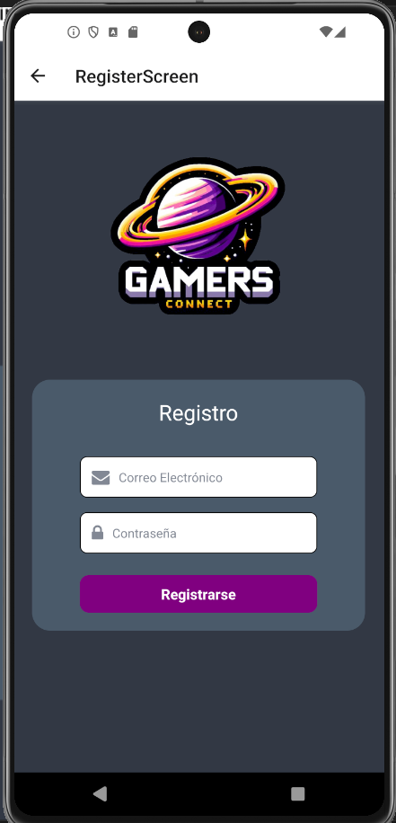
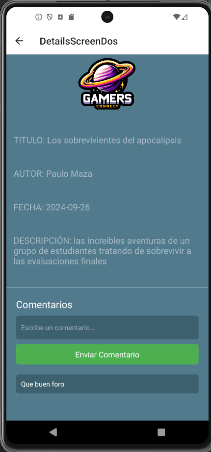

Paulo Esteban Maza Rivera - 20460351

# GAMERS CONNECT


## Descripción del proyecto

GamersConnect surge como respuesta a la creciente demanda de un espacio digital
dedicado a la comunidad gamer. Con millones de jugadores en todo el mundo, existe una
necesidad imperiosa de un lugar donde los aficionados puedan conectarse, compartir
experiencias y descubrir nuevos juegos. Esta plataforma ofrece un ambiente inclusivo y
enriquecedor, facilitando el acceso a información relevante, promoviendo la diversidad y la
camaradería entre los jugadores.
GamersConnect aspira a ser el punto de encuentro definitivo para todos los amantes de los
videojuegos, proporcionando una experiencia en línea única y emocionante para sus
usuarios.

## Estructura del proyecto



## Requisitos de instalación

Asegúrate de tener instalado y configurado Docker antes de comenzar.

- [Expo React Native](https://docs.expo.dev)
- [Visual Studio](https://code.visualstudio.com/download)

## Instrucciones para la instalación

1. Intalar proyecto de expo en la terminal:
   
   ```sh
   npm install --global expo-cli
   ```

2. Clonar repositorio en la máquina local:
   
   ```sh
   https://github.com/PauloMaza777/ReactAndroidDefinitivo2
   ```

3. Ejecutamos el siguiente comando para que nos meta a la carpeta:

    ```sh
    cd ReactAndroidDefinitivo2
    ```

46. Ejecutar el siguiente comando para iniciar abrir el código en Visual Studio:

    ```sh
    code .
    ```
5. Ejecutar el siguiente comando para correr el programa en el localhost:

    ```sh
    npm run android
    ```

    > **IMPORTANTE**
    >
    > Debe estar todo bien instalado y descargado, si no, mandara error 
    > cuando se corra el programa
    >

6. Para mas información, visitar el siguiete enlace:

- [Documentación de React Native](https://reactnative.dev/docs/environment-setup)

## Firebase DataBase

Con la ayuda de un compañero y de mi maestro fue como se llevo a cabo este proyecto con Firebase, debido a multiples errores con otros tipos de Manejadores de base de datos, como de alguna API o de manera local, a continuación se muestra una imagen con la cual se confirma la utilización de una base de datos.



Para mas información, visitar el siguiete enlace:

- [Documentación de FireBase](https://console.firebase.google.com/u/0/?hl=es-419)

## Descripción de las pantallas mas importantes

### LoginScreen
LoginScreen es la pantalla de inicio de sesión donde los usuarios ingresan sus credenciales para acceder a la aplicación. Esta pantalla presenta un formulario sencillo con campos para el nombre de usuario y la contraseña, además de un botón para iniciar sesión. También puede incluir opciones adicionales como recuperar contraseña y registrarse para nuevos usuarios. La autenticación exitosa redirige al usuario a la HomeScreen, permitiéndoles acceder a todas las funcionalidades de la aplicación.


### HomeScreen
HomeScreen es la pantalla principal de la aplicación, donde los usuarios pueden ver una lista de noticias destacadas y acceder a diversas secciones de la app. Al abrir la aplicación, los usuarios son recibidos con un logo en la parte superior, seguido por una lista de noticias extraídas de una base de datos. Los usuarios pueden tocar una noticia para ver más detalles y navegar a otras secciones usando un menú lateral desplegable que incluye opciones como comunidad, foros, biblioteca, categorías, y configuración.


### ContactScreen
ContactScreen es la pantalla donde los usuarios pueden contactar al creador y al soporte técnico de la aplicación enviando un  mensajes o consultas, puede incluir información de contacto adicional como números de teléfono y direcciones de correo electrónico del soporte técnico. El objetivo principal es proporcionar una vía fácil y accesible para que los usuarios puedan comunicar problemas o sugerencias.


### UserScreen
UserScreen es la pantalla de perfil de usuario, donde los usuarios pueden ver y editar su información personal. En esta pantalla, los usuarios pueden actualizar detalles como nombre, correo electrónico, foto de perfil, y otras configuraciones personales. La UserScreen sirve como un hub para la gestión de la cuenta del usuario, garantizando que sus datos estén actualizados y seguros.


### SettingsScreen
SettingsScreen es la pantalla de configuración donde los usuarios pueden personalizar las preferencias de la aplicación. Esta pantalla incluye opciones para ajustar notificaciones, cambiar temas de la interfaz, gestionar privacidad y seguridad, y configurar otras preferencias del usuario. Además, los usuarios pueden acceder a opciones avanzadas como la gestión de datos de la cuenta y la sincronización con otros dispositivos. La SettingsScreen proporciona control total sobre cómo la aplicación se comporta y se presenta al usuario.


### NoticeScreen
NoticeScreen es la pantalla dedicada a la creación y publicación de nuevas noticias. Los usuarios con permisos adecuados pueden acceder a un formulario donde pueden ingresar el título, autor, fecha y descripción de la noticia. Una vez completado el formulario, la noticia se puede publicar para que aparezca en la HomeScreen, manteniendo a la comunidad informada con actualizaciones y eventos recientes.


### DetailsScreen
DetailsScreen es la pantalla donde se muestran los detalles completos de una noticia seleccionada. Cuando un usuario toca una noticia en la HomeScreen, es redirigido a esta pantalla, que presenta toda la información sobre la noticia, incluyendo el título, autor, fecha de publicación y descripción completa, permitiendo una interacción más profunda con el contenido. La DetailsScreen ofrece una vista detallada y enriquecida de cada noticia, mejorando la experiencia de lectura y participación de los usuarios.


Paulo Esteban Maza Rivera - 20460351

